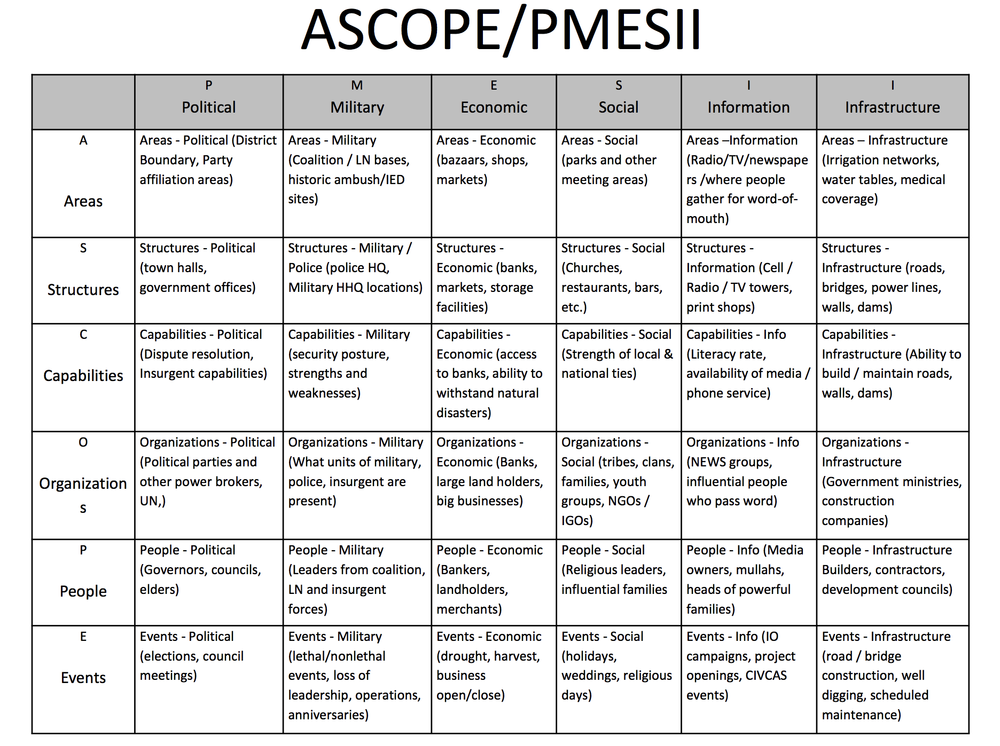
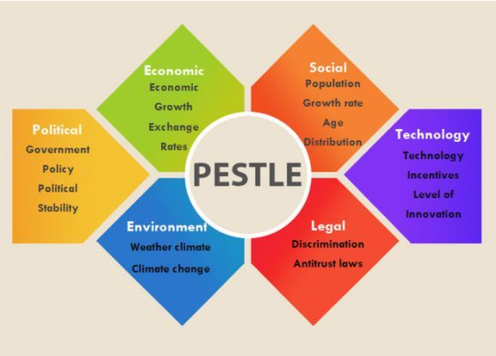

### ** Summary **

Security does not happen in a bubble. Every security policy, setting, and tool needs to be tailored for the specific context of the organization. Particulary with non-profit organizations that work with fewer resources, under different circumstances, and for different motivations than for-profit or government entities, "industry best practice" and boilerplate policies can actually cause more harm than good. Instead, security assistance providers must consider context & capacity of their partner organizations, including the political, economic, social, technological, legal, and environmental factors both within and beyond the organization. 

### ** Learning Objectives **

* Understand how contextual factors can impact an organization's security
* Understand methods to identify relevant contextual factors
* Understand methods to identify and categorize gaps & assumptions in one's analysis
* Understand how to use the PESTLE framework

### ** Pre-Readings **

* See Course Readings for ["Contextual & Capacity Research"](../../../Consolidated_Bibliography#context)

### ** Resources **

* [Contextual Factors (PESTLE-M) Worksheet](../PESTLE-M_Worksheet)

* [Contextual Assessment Information Requirements](../Contextual_Assessment_Info_Reqs)

* Contextual Research Source Tracker (Due Diligence Worksheet.xlsx)

### ** Activities **

** Assumptions Game (for small class size) **

Each student writes an interesting "hard to guess" fact about themselves (that they feel comfortable revealing to the class) on a sticky note and gives to the instructor (or private messages the instructor). The instructor displays all of the "facts" (without the fact's owner) to the entire class. The class votes to match up each fact to a specific student. After each student is assigned a fact, the instructor asks which students have the correct fact assigned to them. When students are correctly matched with a fact, the class discusses why or why not they made that guess. Conduct multiple rounds until all students are assigned their correct fact.

** Assumptions Game (for large class size) **

Each student writes three interesting facts about themselves believed to be unique among the rest of the class. Ensure that students feel comfortable revealing this information to the rest of the class. One by one, have students state the 3 facts and then see, by show of hands, whether any facts might also any describe other students. If a student raises their hand, the student that stated the 3 facts must guess which of the facts is shared between the two students. 

### ** Discussion **

Why were some "secrets" figured out quickly while others took a long time?

Consider the following perspectives:

_“I shall reconsider human knowledge by starting from the fact that we can know more than we can tell”_ Michael Polanyi, The Tacit Dimension (1966)

_“No man ever looks at the world with pristine eyes. He sees it edited by a definite set of customs and institutions and ways of thinking.”_ Ruth Benedict, Patterns of Culture (1976)

_“Experienced analysts have an imperfect understanding of what information they actually use in making judgments. They are unaware of the extent to which **their judgments are determined by a few dominant factors,** rather than by the systematic integration of all available information. Analysts actually use much less of the available information than they think they do.”_ Richards J. Heuer, Jr., Psychology of Intelligence Analysis (2007)

Would considering (ie, "thinking hard") these insights have impacted your guesses during the activities?

### ** Input **

There's an enormous range of factors that can impact and influence the security of an organization. We need a systematic approach to narrow relevant “context” down, including:

* What should we search for?
* How do we organize the information we collect?
* What relevant information are we missing?
* What are our assumptions?

Existing frameworks include:

1) Frontline Defenders' Workbook on Security: Practical Steps for Human Rights Defenders at Risk [CONTEXT ANALYSIS QUESTIONS](https://www.frontlinedefenders.org/en/file/1111/download?token=7aoFdNX3)

2) SAFETAG. [https://safetag.org/guide/](https://safetag.org/guide/)

How to use SAFETAG:

* A “How-To”
* A checklist
* A list of information resources 

SAFETAG (“Guiding Questions” from Section 2.2 “Context”):

* What infrastructural barriers exist in the region?
* What are the top, non-targeted digital threats in this region?
* What are the top targeted digital threats facing organizations doing this work in this region / country?
* Are there legal ramifications to digital security in the country? (e.g. legality of encryption, anonymity tools, etc.)
* Has any organization or individual made specific threats, or demonstrated intention or mindset to attack on the organization or similar organizations?

SAFETAG (“Guiding Questions” from Section 2.3 “Capacity”):

* What is the organization's ability to adopt new technologies or practices?
* What resources does the organization have available to them?
* What is the environment that the organization works within like? What barriers, threat actors, and other aspects influence their work?
* Are there any specific considerations for the audit that would require modifying the overall approach, tools, preparation steps, or timeline?

3) PMESII-PT Operational Variables may be seen in some INFOSEC circles. 

Considers Political, Military, Economic, Social, Infrastructure, Information, Physical Environment, and Time factors, usually in a "crosswalk" matrix with "ASCOPE civil considerations" (Area, Structures, Capabilities, Organizations, People, Events). However, same as in describing threats, we'll want to avoid adopting miltaristic terminology and methods. See example:

 [Image source: US Marine Corps Training Command]

4) Especially in the business world, PESTLE (or PEST) may be a good choice for categorizing contextual factors. 

 [Source: Free Templates]

Political, Economic, Social, Technological, Legal, Environment (and sometimes Military) factors can be displayed in a matrix bounded by:

* SWOT: Strength, Weaknesses, Opportunities, Threats
* Time: Past, Present, Future 
* Control:  Internal (within Organization’s Control), External Factors (Within Organization’s Influence), External Factors (Beyond Organization’s Influence)

### ** Deepening **

As a class, work through the [Contextual Factors (PESTLE-M) Worksheet](../PESTLE-M_Worksheet) for an example or actual partner organization.

Additionally, discuss the following:

* In which ways could you discover this information?
* How do you do this securely? Collaboratively?
* What might cause you to stop the process?

### ** Synthesis **

Great example from STS ethnography on why this is important:

_“The [Xerox copier repair] technicians should be viewed as an occupational community (van Maanen and Barley 1984). They are focused on the work, not the organization, and the only valued status is that of full member of the community, that is, being considered a competent technician. In pursuit of this goal, they share information, assist in each other's diagnoses, and compete in terms of their relative expertise. Promotion out of the community is thought not to be worthwhile. The occupational community shares few cultural values with the corporation; technicians from all over the country are much more alike than a technician and a salesperson from the same district.”_ Julian Orr, Talking About Machines (1996)

Do the members of your client org consider themselves members of an occupational community before the organization?

### ** Assignments **

** PESTLE Analysis Brief **

* You will create a 10 minute brief on a contextual factor that is relevant to your client’s organization. While you will receive individual credit for this assignment, do collaborate as a team in order to plan, collect, and analyze this information. 

* Planning (As a Team). Create a game plan with your team so that each of your team members’ efforts focus on a relevant PESTLE category of factors. 

	* Create a team collective document / spreadsheet  where you can keep a running track of information / sources as you collect them. You will need to maintain this over the course of the semester and you will add to it as you complete your research & interviews with your client. 

	* Select topics that each team individually will research in breadth (eg. encompass a range of political factors that may affect your client) or in depth (eg. research how a specific data protection law might impact your client). Strive to meaningfully inform the other members of your team about content that is directly relevant to your client’s security posture. 

	* You may need to perform some initial research as a team to understand what important topics may be to consider. Your client’s website or other bits of information about your client organization may be a great place to start to do this planning - what is their mission? What recent work have they promoted? 

* Collection. Seek open source information - this is a broad category that can include books, studies, websites, social media. Again, do not soley focus on collecting information from your client. This is the time to do your homework on the topic but also to figure out the best way for your team to collect / store this information. Remember: we are at one of the premier research universities in the world. There may be a subject matter expert available at UC Berkeley who can help you navigate a complex topic.

* Analysis. Perform some meaningful analysis on your topic instead of simply recalling information found online. For example, tell us why the education level or types of employees at the organization matter to their cybersecurity or to the Clinic’s work. Focus on providing the answer to “So what? Why does this matter?” when you provide information for your team. 
